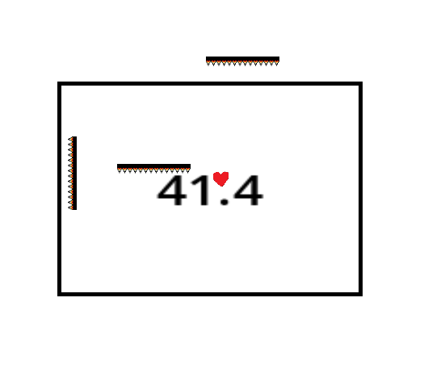

# RunRunRun
My Warioware style game with minigames, inspired by Undertale.
Made in Godot.

# Features
3 minigames\
5 lives, a timer screen\
Win and loss scene\
Able to replay\
Settings page to choose difficulty\

# How to play

1. Choose your difficulty. 

2. Press "Start"

3. Level 1: Use left and right arrows for movement, spacebar to jump. Collect the keys to pass. Number of keys needed depends on difficulty level.

4. Level 2: Click on Sans. Click enough Sans within 7 seconds to pass. Again, number of Sans needed depends on difficulty level.

5. Level 3: Use up/down/left/right arrow keys to move the heart. Dodge the missiles and the spikes for 45 seconds to pass. Speed and rate of spawn of projectiles depends on difficulty level.

If you manage to pass all within 5 tries, you win!\
Else, you lose.\
Either way, you will be redirected to the options screen where you can replay or go to the endscene.\

Hope you have fun!

# Demo link:
https://arsenal4eva.itch.io/run-run-run

Go to the link and play in browser

Credits:

Hugely inspired by Undertale

Sans art was found online

Made for Stardance

